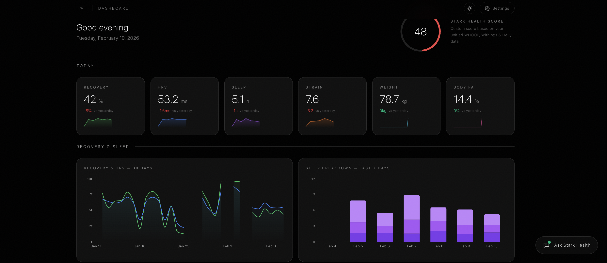
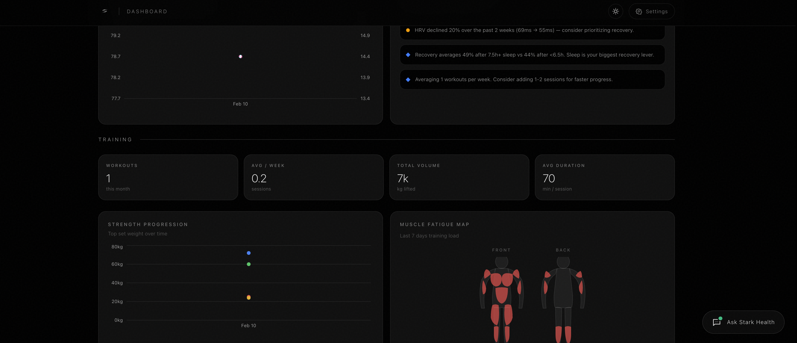
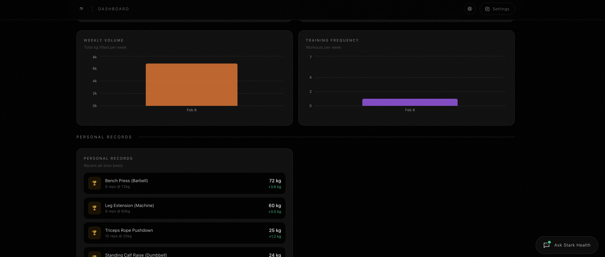
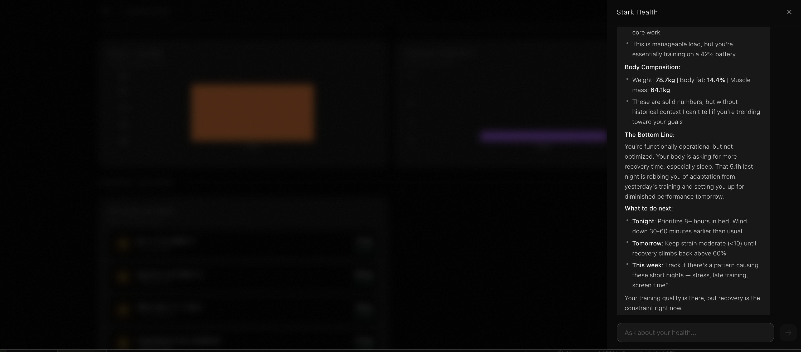
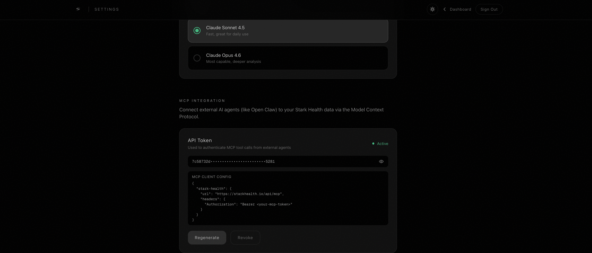
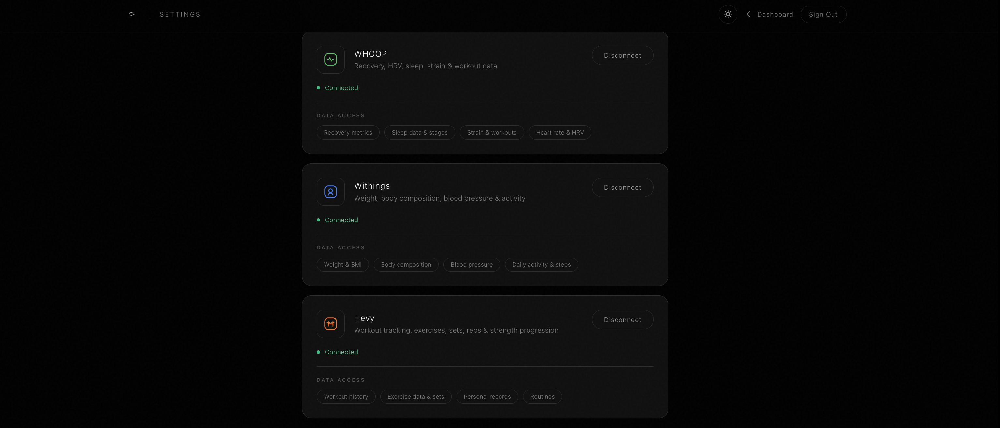

# Stark Health

**Health intelligence, unified.** Aggregate data from WHOOP, Withings, Hevy, and more into a single elegant dashboard with an AI-powered longevity coach.

---

## What is Stark Health?

Stark Health is an open-source health data platform that connects your wearables and fitness apps into one unified view. Instead of switching between WHOOP for recovery, Withings for body composition, and Hevy for workouts, you get a single dashboard that cross-references all your data and surfaces insights no single app can provide.

An AI assistant (powered by Claude) acts as your personal longevity and performance coach — analyzing your real data, spotting correlations between sleep and training output, and giving you specific, actionable recommendations.

### Key Features

- **Unified Dashboard** — Recovery, HRV, sleep, strain, weight, body composition, and workout data in one view
- **Stark Health Score** — Proprietary composite score (0-100) combining recovery, sleep, HRV, body composition, and training consistency
- **AI Health Coach** — Chat with Claude about your data. Gets specific: "Your HRV dropped 40% after yesterday's leg session — consider a recovery day"
- **Expandable Metric Cards** — Click any metric to see 7/14/30-day trends with min, avg, max stats
- **Muscle Fatigue Map** — Visual body heat map showing training load per muscle group
- **Strength Progression** — Track key lifts (bench, squat, deadlift, OHP) over time
- **Light/Dark Theme** — Full theme system with toggle, persisted to localStorage
- **MCP Server** — External AI agents (like Open Claw) can access your health data and AI coach via the Model Context Protocol
- **Units Preference** — Switch between metric (kg, km) and imperial (lbs, mi) in Settings
- **Account Management** — Full sign up/in/out flow, account deletion with confirmation
- **Privacy-First** — Bring your own API keys, self-host your database, own your data. No mock data in production — only real provider data shown
- **Data Caching** — Health data cached in Supabase with 4-hour TTL for fast loads

### Screenshots

**Dashboard — Today's Snapshot & Recovery**
Your Stark Health Score, today's key metrics (Recovery, HRV, Sleep, Strain, Weight, Body Fat), and recovery/sleep trend charts. Click any metric card to drill into 7/14/30-day trends.



**Dashboard — Body Composition & Cross-Source Insights**
Body composition trends alongside AI-generated insights that cross-reference your WHOOP recovery, Withings body data, and Hevy training — updated automatically as new data comes in.



**Dashboard — Training Analytics**
Hevy workout data: training frequency, weekly volume, strength progression for your actual exercises, muscle fatigue body map, and personal records.



**AI Health Coach — Ask Stark Health**
Chat with your personal longevity coach. It has access to all your real health data and gives specific, data-driven recommendations — not generic advice.



**MCP Server — Connect External AI Agents**
Generate an API token and connect agents like Open Claw to your health data via the Model Context Protocol. Your AI assistant gets direct access to your recovery, sleep, training, and body composition.



**Settings — Connected Data Sources**
Connect WHOOP and Withings via OAuth, add your Hevy API key, choose your Claude model, and manage your account.



---

### Supported Integrations

| Provider | Auth Method | Data |
|---|---|---|
| **WHOOP** | OAuth 2.0 | Recovery, HRV, resting heart rate, sleep stages, strain, calories |
| **Withings** | OAuth 2.0 | Weight, body fat %, muscle mass, steps |
| **Hevy** | API Key | Workouts, exercises, sets, reps, weight, PRs |

---

## Tech Stack

| Layer | Technology |
|---|---|
| Framework | [Next.js 16](https://nextjs.org/) (App Router, TypeScript) |
| Styling | [Tailwind CSS v4](https://tailwindcss.com/) |
| Auth & Database | [Supabase](https://supabase.com/) (PostgreSQL, Row Level Security) |
| AI | [Anthropic Claude](https://anthropic.com/) via [Vercel AI SDK](https://sdk.vercel.ai/) |
| Charts | [Recharts](https://recharts.org/) |
| Deployment | [Vercel](https://vercel.com/) |

---

## Self-Hosting Guide

This guide walks you through deploying your own instance of Stark Health. You'll need accounts with Supabase and (optionally) WHOOP and Withings developer portals.

### Prerequisites

- Node.js 20+
- A [Supabase](https://supabase.com/) account (free tier works)
- (Optional) A [WHOOP developer](https://developer.whoop.com/) account for WHOOP integration
- (Optional) A [Withings developer](https://developer.withings.com/) account for Withings integration
- Each user provides their own [Anthropic](https://console.anthropic.com/) API key and [Hevy](https://hevy.com/settings?developer) API key through the Settings page

### 1. Clone and install

```bash
git clone https://github.com/ilan-ibh/starkhealth.git
cd starkhealth
npm install
```

### 2. Set up Supabase

1. Create a new project at [supabase.com/dashboard](https://supabase.com/dashboard)
2. Go to **SQL Editor** and run the following migrations in order:
   - [`supabase/schema.sql`](supabase/schema.sql) — Core tables (profiles, triggers)
   - [`supabase/migration-002-providers.sql`](supabase/migration-002-providers.sql) — OAuth token storage
   - [`supabase/migration-003-cache.sql`](supabase/migration-003-cache.sql) — Health data cache
   - [`supabase/migration-004-mcp-token.sql`](supabase/migration-004-mcp-token.sql) — MCP token column
   - [`supabase/migration-005-mcp-verify.sql`](supabase/migration-005-mcp-verify.sql) — MCP RPC functions
3. Go to **Project Settings > API** and copy your project URL and anon key
4. Go to **Authentication > URL Configuration** and set:
   - **Site URL**: Your deployment URL (e.g., `http://localhost:3000` for local dev)
   - **Redirect URLs**: Add `http://localhost:3000/**` (and your production URL if deploying)

### 3. Set up WHOOP (optional)

1. Register an app at [developer.whoop.com](https://developer.whoop.com)
2. Set the redirect URL to `https://your-domain.com/whoop/callback`
3. Note your Client ID and Client Secret
4. Your app works immediately for up to 10 test users (no approval needed)

### 4. Set up Withings (optional)

1. Register an app at [developer.withings.com](https://developer.withings.com)
2. Set the callback URL to `https://your-domain.com/auth/withings/callback`
3. Note your Client ID and Client Secret
4. In development mode, only the account that created the app can authorize

### 5. Configure environment variables

```bash
cp .env.example .env.local
```

Edit `.env.local`:

```env
# Required — Supabase
NEXT_PUBLIC_SUPABASE_URL=https://your-project.supabase.co
NEXT_PUBLIC_SUPABASE_ANON_KEY=your-anon-key
NEXT_PUBLIC_SITE_URL=http://localhost:3000

# Optional — WHOOP OAuth (omit to disable WHOOP integration)
WHOOP_CLIENT_ID=your-whoop-client-id
WHOOP_CLIENT_SECRET=your-whoop-client-secret

# Optional — Withings OAuth (omit to disable Withings integration)
WITHINGS_CLIENT_ID=your-withings-client-id
WITHINGS_CLIENT_SECRET=your-withings-client-secret
```

> **Note:** Anthropic API keys and Hevy API keys are provided by each user through the Settings page. No server-side keys are needed for those.

### 6. Run locally

```bash
npm run dev
```

Open [http://localhost:3000](http://localhost:3000). Sign up, connect your providers in Settings, add your Anthropic API key, and you're good to go.

---

## Deploy to Vercel

[](https://vercel.com/new/clone?repository-url=https://github.com/ilan-ibh/starkhealth&env=NEXT_PUBLIC_SUPABASE_URL,NEXT_PUBLIC_SUPABASE_ANON_KEY,NEXT_PUBLIC_SITE_URL)

1. Click the button above or run `vercel` from the project root
2. Add all environment variables (see table below)
3. Set `NEXT_PUBLIC_SITE_URL` to your Vercel deployment URL
4. Update your Supabase **Site URL** and **Redirect URLs** to match
5. Update your WHOOP/Withings redirect URLs to match

---

## Environment Variables

| Variable | Required | Description |
|---|---|---|
| `NEXT_PUBLIC_SUPABASE_URL` | Yes | Your Supabase project URL |
| `NEXT_PUBLIC_SUPABASE_ANON_KEY` | Yes | Your Supabase anonymous/public key |
| `NEXT_PUBLIC_SITE_URL` | Yes | Your deployment URL (e.g., `https://yourdomain.com`) |
| `WHOOP_CLIENT_ID` | For WHOOP | WHOOP OAuth client ID ([developer.whoop.com](https://developer.whoop.com)) |
| `WHOOP_CLIENT_SECRET` | For WHOOP | WHOOP OAuth client secret |
| `WITHINGS_CLIENT_ID` | For Withings | Withings OAuth client ID ([developer.withings.com](https://developer.withings.com)) |
| `WITHINGS_CLIENT_SECRET` | For Withings | Withings OAuth client secret |

---

## Database Schema

Four tables with Row Level Security — users can only access their own data.

### `profiles`
Created automatically when a user signs up.

| Column | Type | Description |
|---|---|---|
| `id` | uuid (PK) | References `auth.users` |
| `anthropic_api_key` | text | User's Anthropic API key |
| `ai_model` | text | Selected AI model (`claude-sonnet-4-5-20250929` or `claude-opus-4-6`) |
| `units` | text | `metric` or `imperial` |
| `mcp_token` | text | MCP API token for external agent access |

### `provider_tokens`
Stores OAuth tokens and API keys per provider per user.

| Column | Type | Description |
|---|---|---|
| `user_id` | uuid (FK) | References `auth.users` |
| `provider` | text | `whoop`, `withings`, or `hevy` |
| `access_token` | text | OAuth access token or API key |
| `refresh_token` | text | OAuth refresh token (null for Hevy) |
| `expires_at` | timestamptz | Token expiry (auto-refreshed) |

### `health_cache`
Caches daily health metrics (4-hour TTL).

| Column | Type | Description |
|---|---|---|
| `user_id` | uuid | References `auth.users` |
| `date` | date | Day of the data |
| `data` | jsonb | All metrics for that day |
| `synced_at` | timestamptz | Last sync time |

### `workout_cache`
Caches Hevy workout data.

| Column | Type | Description |
|---|---|---|
| `user_id` | uuid | References `auth.users` |
| `workout_id` | text | Hevy workout ID |
| `data` | jsonb | Full workout object |
| `synced_at` | timestamptz | Last sync time |

---

## Project Structure

```
src/
├── app/
│   ├── api/
│   │   ├── [transport]/route.ts      # MCP server (refresh_health_data + ask_stark_health)
│   │   ├── account/route.ts          # Account deletion
│   │   ├── chat/route.ts             # AI chat (streams Claude responses from cached data)
│   │   ├── health-data/route.ts      # Unified data endpoint (cache + provider fetch)
│   │   ├── settings/route.ts         # User profile CRUD + MCP token
│   │   ├── whoop/auth/route.ts       # WHOOP OAuth initiation
│   │   ├── whoop/callback/route.ts   # WHOOP OAuth callback
│   │   └── withings/auth/route.ts    # Withings OAuth initiation
│   ├── auth/withings/callback/        # Withings OAuth callback
│   ├── whoop/callback/                # WHOOP OAuth callback (matches registered URL)
│   ├── dashboard/page.tsx             # Main health dashboard
│   ├── login/page.tsx                 # Sign in / sign up
│   ├── privacy/page.tsx               # Privacy policy
│   ├── settings/page.tsx              # API keys, connections, AI model, account
│   ├── globals.css                    # Theme system (CSS variables, light/dark)
│   ├── layout.tsx                     # Root layout with theme init
│   └── page.tsx                       # Landing page
├── components/
│   ├── Charts.tsx                     # Recovery, body composition, sleep charts
│   ├── ChatPanel.tsx                  # AI chat slide-in panel with markdown rendering
│   ├── HealthScore.tsx                # Animated Stark Health Score ring
│   ├── MetricCard.tsx                 # Clickable metric card with sparkline
│   ├── MetricDetail.tsx               # Expanded metric view (7d/14d/30d chart + stats)
│   ├── MuscleMap.tsx                  # Muscle fatigue body heat map
│   ├── ThemeToggle.tsx                # Light/dark mode toggle
│   └── WorkoutCharts.tsx              # Volume, frequency, strength, PRs charts
├── lib/
│   ├── providers/
│   │   ├── whoop.ts                   # WHOOP API client (fetch + token refresh)
│   │   ├── withings.ts                # Withings API client (fetch + token refresh)
│   │   └── hevy.ts                    # Hevy API client
│   ├── supabase/
│   │   ├── client.ts                  # Browser Supabase client
│   │   ├── middleware.ts              # Auth middleware helper
│   │   └── server.ts                  # Server Supabase client
│   ├── health-context.ts              # Shared AI system prompt + data builder
│   ├── hevy-data.ts                   # Hevy types + analytics functions
│   └── sample-data.ts                 # WHOOP/Withings types
└── middleware.ts                       # Route protection (/dashboard, /settings)

supabase/
├── schema.sql                          # Core schema (profiles + triggers)
├── migration-002-providers.sql         # Provider token storage
├── migration-003-cache.sql             # Health data cache tables
└── migration-004-mcp-token.sql         # MCP token column
```

---

## How It Works

### Data Flow

1. User connects WHOOP/Withings via OAuth or adds Hevy API key in Settings
2. Tokens stored securely in Supabase `provider_tokens` table (RLS enforced)
3. Dashboard loads `/api/health-data` which checks the cache first (4-hour TTL)
4. If cache is stale, fetches fresh data from all connected providers in parallel
5. Data merged into unified daily format, cached to Supabase, returned to dashboard
6. AI chat reads from the same cache — no redundant API calls

### Stark Health Score

A composite score (0-100) weighted across five dimensions:

| Factor | Weight | Source |
|---|---|---|
| Recovery | 25% | WHOOP recovery score |
| Sleep | 20% | WHOOP sleep performance |
| HRV | 20% | WHOOP heart rate variability |
| Body Composition | 15% | Withings body fat trend |
| Training Consistency | 20% | Hevy workout frequency + progressive overload |

**Smart data handling:**
- Only data from the last **48 hours** counts toward the score — stale metrics are excluded automatically
- Weights redistribute proportionally when a metric is unavailable (e.g., if no body fat data, the other factors share its 15%)
- Requires at least 2 fresh metrics to display a score — otherwise shows "Not enough data"
- Each metric card shows a **recency label** (today / yesterday / 2d ago) so you always know how fresh the data is
- Delta comparisons use the two most recent non-null values, not just consecutive days

### AI Coach

The AI assistant uses a detailed system prompt designed to act as a longevity and performance coach (not a generic chatbot). It:

- References your actual numbers and dates
- Cross-correlates sleep, recovery, training, and body composition
- Gives specific, actionable recommendations with timing and dosing
- Thinks longitudinally (trends over weeks, not just today)
- Supports Claude Sonnet 4.5 (fast) and Claude Opus 4.6 (deep analysis)

Each user provides their own Anthropic API key — your data and API usage stay private.

### MCP Server (Model Context Protocol)

Stark Health exposes an MCP server that allows external AI agents to access your health data and the Stark Health AI coach. This means your personal AI assistant (like [Open Claw](https://github.com/openclaw)) can directly query your WHOOP, Withings, and Hevy data without you having to copy-paste anything.

**Available MCP Tools:**

| Tool | Description |
|---|---|
| `refresh_health_data` | Forces a fresh sync from all connected providers. Returns a structured summary of recovery, HRV, sleep, strain, weight, body composition, and workout data. |
| `ask_stark_health` | Sends a question to the Stark Health AI coach with your full health data as context. Uses your selected Claude model. Returns personalized analysis and recommendations. |

**Setup:**

1. Go to **Settings > MCP Integration** in Stark Health
2. Click **Generate Token** to create a dedicated API token
3. Add the following to your MCP client configuration:

```json
{
  "stark-health": {
    "url": "https://your-domain.com/api/mcp",
    "headers": {
      "Authorization": "Bearer <your-mcp-token>"
    }
  }
}
```

For stdio-only MCP clients, use the `mcp-remote` bridge:

```json
{
  "stark-health": {
    "command": "npx",
    "args": [
      "-y", "mcp-remote",
      "https://your-domain.com/api/mcp",
      "--header", "Authorization:Bearer <your-mcp-token>"
    ]
  }
}
```

**Open Claw Integration:**

If you use [Open Claw](https://github.com/openclaw) as your personal AI agent, adding Stark Health as an MCP server gives Open Claw direct access to all your health data. Open Claw can then:

- Proactively check your recovery before suggesting a schedule for the day
- Factor in your sleep quality when planning your workday
- Ask Stark Health's AI coach for training recommendations and relay them to you
- Cross-reference your health data with your calendar, tasks, and other tools
- Answer questions like "How did I sleep last week?" or "Am I recovered enough to train today?" using real data

This turns your health data from a passive dashboard into an active input for your AI-powered daily workflow.

---

## Database Schema

Four tables with Row Level Security — users can only access their own data.

*Note: Run all migration files in order when setting up:*
1. `supabase/schema.sql`
2. `supabase/migration-002-providers.sql`
3. `supabase/migration-003-cache.sql`
4. `supabase/migration-004-mcp-token.sql`

1. Fork the repository
2. Create a feature branch (`git checkout -b feature/my-feature`)
3. Commit your changes (`git commit -m 'Add my feature'`)
4. Push to the branch (`git push origin feature/my-feature`)
5. Open a Pull Request

---

## License

MIT — see [LICENSE](LICENSE) for details.

---

## Links

- **Website**: [starkhealth.io](https://starkhealth.io)
- **Email**: [contact@starkhealth.io](mailto:contact@starkhealth.io)
- **GitHub**: [github.com/ilan-ibh/starkhealth](https://github.com/ilan-ibh/starkhealth)
